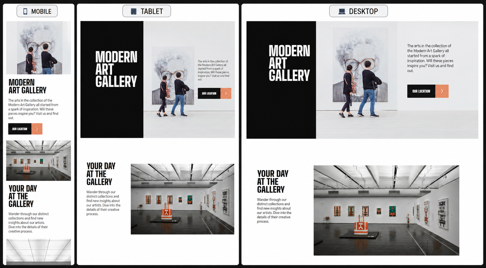

# Modern Art Gallery

## 📌 Descripción

Modern Art Gallery es una landing page responsive desarrollada como práctica de maquetación frontend.

El proyecto fue construido siguiendo una metodología Mobile First, utilizando HTML semántico, SASS modularizado y metodología BEM para mantener una estructura escalable y fácil de mantener.

Durante el desarrollo se trabajó especialmente en la construcción de layouts complejos utilizando CSS Grid y Flexbox, adaptando el diseño a diferentes resoluciones de pantalla.

---

## 🎯 Objetivo

Practicar:

* Mobile First
* CSS Grid
* Flexbox
* Organización escalable con SASS
* Metodología BEM
* Responsive Design

---

## 🚀 Tecnologías

* HTML5
* CSS3
* SASS (SCSS)
* Vite
* CSS Grid
* Flexbox
* BEM

---

## 📸 Preview




---

## 🌐 Deploy

👉 [Ver sitio en vivo](https://modern-art-gallery-gamma.vercel.app/)

---

## 📂 Estructura del Proyecto

```text
src/
│
├── abstracts/
│   ├── _variables.scss
│   └── _mixins.scss
│
├── base/
│   ├── _globales.scss
│   └── _tipografia.scss
│
├── components/
│   └── botones.scss
│
├── layout/
│   └── footer.scss
│
├── pages/
│   ├── _index.scss
│   └── _location.scss
│
└── style.scss
```

---

## ⚙️ Instalación

```bash
npm install
npm run dev
```

---

## 📚 Aprendizajes

Durante el desarrollo se reforzaron conceptos como:

* Organización de proyectos con arquitectura SASS.
* Uso avanzado de CSS Grid.
* Responsive Design con breakpoints.
* Estructuración de componentes mediante BEM.
* Flujo de trabajo con Git y GitHub.

---

## 📚 Desafíos Encontrados

- Superposición de elementos usando CSS Grid.
- Organización de archivos SASS con arquitectura modular.
- Adaptación del header a distintas resoluciones.
- Manejo de layouts complejos con Grid Areas.

## 👨‍💻 Autor

Jorge Cao

Proyecto realizado como práctica de desarrollo frontend.
